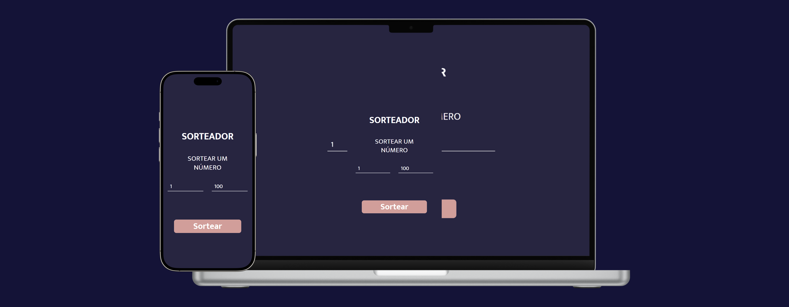

# Sorteador

Este é um projeto simples de um sorteador de números. O usuário deve inserir dois valores numéricos e, ao clicar no botão "Sortear", um número aleatório dentro do intervalo especificado será gerado e exibido na tela. **[Link do projeto](https://davirrocha.github.io/sorteador/)**

## Tecnologias Utilizadas

- HTML5: Estrutura do site.

- CSS3: Estilização do layout.

- JavaScript: Lógica para interação com o usuário.